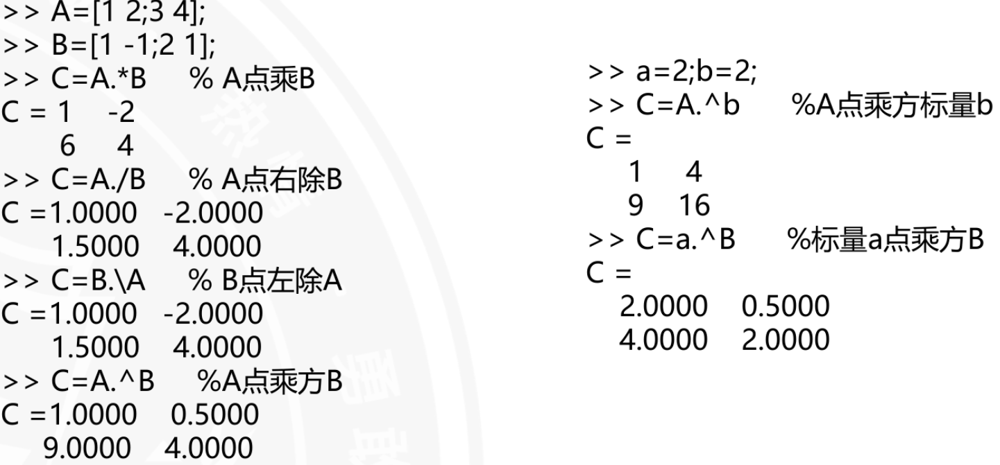

# 控制流程语句
## M文件
### M文件定义
* 以.m为扩展名，包含函数、变量、语句等。
* 是由若干matlab语句组成的文本文件。可以完成一些复杂的数值计算、数据处理、图形绘制、数据分析等任务。
* 根据调用方式，可以分为脚本文件（.m文件）、函数文件（.m文件）、模块文件（.m文件）、宏文件（.m文件）等。
### 新建一个M文件的步骤
1. 打开MATLAB。
2. 在命令行窗口输入`edit filename.m`，其中filename是你要新建的文件名。
3. 在编辑器中输入matlab语句。
4. 保存文件。
### 脚本示例
```matlab
% 脚本示例
clear;
f=input("输入华氏温度值");
c=5*(f-32)/9;
fprintf('摄氏温度值是%g\n',c);
```
### 运算优先级

### M文件的控制流
* 顺序执行：从上到下依次执行。
* 选择执行：根据条件判断，选择执行某一分支。
* 循环执行：重复执行某一语句或代码块。
* 跳转执行：从当前位置跳转到其他位置执行。
### 1. 选择执行
```matlab
% 选择执行示例
a=10;
b=20;
if a>b
    disp('a is greater than b');
else
    disp('b is greater than or equal to a');
end
```
执行结果
```
b is greater than or equal to a
```
### 2. 跳转执行
```matlab
% 跳转执行示例
a=10;
b=20;
if a>b
    disp('a is greater than b');
    goto 20;
end
disp('b is greater than or equal to a');
20 disp('This is the end of the program');
```
执行结果
```
b is greater than or equal to a
This is the end of the program
```
### 3. 循环执行
```matlab
% 循环执行示例
a=1;
while a<=10
    disp(a);
    a=a+1;
end
```
执行结果
```
12345678910
```
### 4. 嵌套循环
```matlab
% 嵌套循环示例
for i=1:3
    for j=1:3
        disp(i*j);
    end
end
```
执行结果
```
123246369
```
## 相关函数
### 1. 数据输入input
```matlab
% 数据输入示例
a=input('Enter a number: ');
b=input('Enter another number: ');
disp(a+b);
```
执行结果
```
Enter a number: 10
Enter another number: 20
30
```
### 2. 数据输出disp
```matlab
% 数据输出示例
a=10;
b=20;        
disp(a);
disp(b);
```
执行结果
```                                                                                
10
20
```
### 3. 数据输出fprintf
```matlab
% 数据输出示例
a=10;
b=20;        
fprintf('a = %d\n',a);
fprintf('b = %d\n',b);
```
执行结果
```
a = 10
b = 20
```
### 4. 暂停程序pause
```matlab
% 暂停程序示例
a=10;
b=20;
disp(a);
pause;
disp(b);
```
执行结果
```
10
Press any key to continue...
20
```
### 5. 退出程序exit
```matlab
% 退出程序示例
a=10;
b=20;
if a>b
    disp('a is greater than b');
    exit;
end
disp('b is greater than or equal to a');
```
执行结果
```
b is greater than or equal to a
```


### 
## 控制流语句
### 1. if语句
```matlab
% if语句示例
a=10;
b=20;
if a>b
    disp('a is greater than b');
else
    disp('b is greater than or equal to a');
end
```
执行结果
```
b is greater than or equal to a
```
### 2. switch语句
```matlab
% switch语句示例
a=1;
switch a
    case 1
        disp('a is equal to 1');
    case 2
        disp('a is equal to 2');
    otherwise
        disp('a is not equal to 1 or 2');
end
```
执行结果
```
a is equal to 1
```
### 3. for语句
```matlab
% for语句示例
for i=1:3
    disp(i);
end
```
执行结果
```
1
2
3
```
### 4. while语句
```matlab
% while语句示例
a=1;
while a<=10
    disp(a);
    a=a+1;
end
```
执行结果
```
12345678910
```
### 5.break语句
```matlab
% break语句示例
a=1;
while a<=10
    if a==5
        break;
    end
    disp(a);
    a=a+1;
end
```
执行结果
```
1234
```
### 6. continue语句
```matlab
% continue语句示例
a=1;
while a<=10
    if a==5
        continue;
    end
    disp(a);
    a=a+1;
end
```
执行结果
```
1234678910
```
# 函数调用
## 简介
* 函数文件由function语句引导，后面跟着函数名、参数列表和函数体。
* 函数调用时，先声明函数，然后调用函数。
* 第一行为引导行，表示该文件是一个函数文件。
* 第二行为函数定义行，以function关键字开始，后面跟着函数名、参数列表和函数体。
* 第三行为函数调用行，以函数名开始，后面跟着参数列表。
## 语法
```matlab
function [output1,output2,...,outputn] = function_name(input1,input2,...,inputn)
end
```
* 当输出参数个数为多个时，使用逗号分隔。，方括号表示输出参数。
* 函数必须是一个单独的M文件
## 示例
```matlab
% 函数定义示例
function y=myfun(x)
    y=x^2;
end
```
## 函数调用的一般格式
* 实参的顺序与形参的顺序保持一致
* 函数可以嵌套调用，甚至可以自身调用，称为递归调用。
* 函数可以返回多个值，称为多返回值函数。
* 函数可以接受结构体作为参数，称为结构体参数。
* MATLAB用两个永久变量nargin和nargout来表示输入参数和输出参数的个数。
## 实例
递归函数示例
```matlab
% 递归函数示例
function y=myfun(x)
    if x==1
        y=1;
    else
        y=x*myfun(x-1);
    end
end
```
调用函数示例
```matlab
% 函数调用示例
y=myfun(5);
disp(y);
```
执行结果
```
120
```        
# MATLAB其他函数库
## 1. 数学函数库
* 数学函数库提供了一些常用的数学函数，如sin、cos、tan、exp、log、sqrt等。
* 调用方式：math.function_name(argument1,argument2,...)
## 2. 绘图函数库
* 绘图函数库提供了一些常用的绘图函数，如plot、bar、hist等。
* 调用方式：graphics.function_name(argument1,argument2,...)
## 3. 字符串函数库
* 字符串函数库提供了一些常用的字符串处理函数，如strcmp、strcat、strrep等。
* 调用方式：strfun.function_name(argument1,argument2,...)
## 4. 矩阵运算函数库
* 矩阵运算函数库提供了一些常用的矩阵运算函数，如inv、det、trace等。
* 调用方式：matrixfun.function_name(argument1,argument2,...)
## 5. 随机数函数库
* 随机数函数库提供了一些常用的随机数生成函数，如rand、randn等。
* 调用方式：randfun.function_name(argument1,argument2,...)
## 6. 日期和时间函数库
* 日期和时间函数库提供了一些常用的日期和时间处理函数，如datenum、datestr等。
* 调用方式：datefun.function_name(argument1,argument2,...)  
## 7.场论函数库
* 场论函数库提供了一些常用的场论函数，如grad、curl等。
* 调用方式：physics.function_name(argument1,argument2,...)  
## 傅里叶分析函数库
* 傅里叶分析函数库提供了一些常用的傅里叶分析函数，如fft、ifft等。
* 调用方式：signal.function_name(argument1,argument2,...)  
## 结构阵列函数库
* 结构阵列函数库提供了一些常用的结构阵列处理函数，如cat、cellstr等。
* 调用方式：structfun.function_name(argument1,argument2,...)  
## 单元阵列函数库
* 单元阵列函数库提供了一些常用的单元阵列处理函数，如iscell、isnumeric等。
* 调用方式：cellfun.function_name(argument1,argument2,...)  
