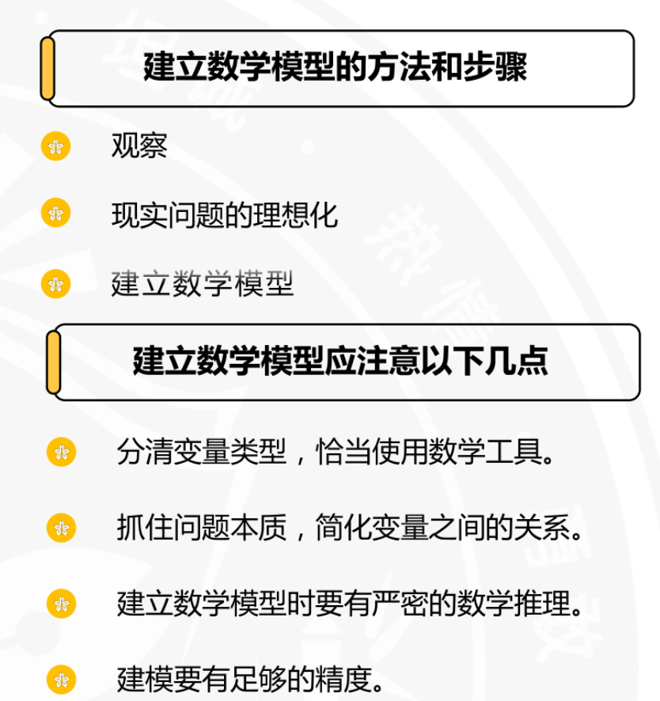
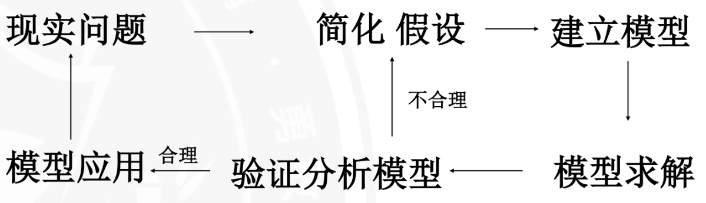
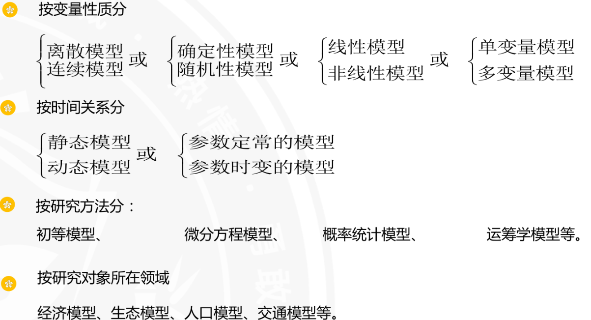
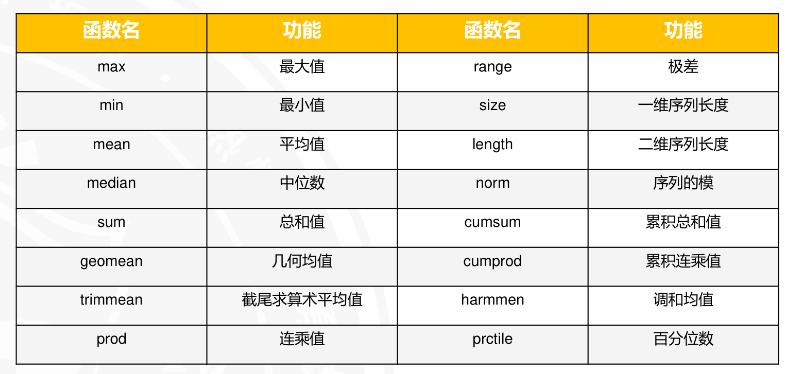
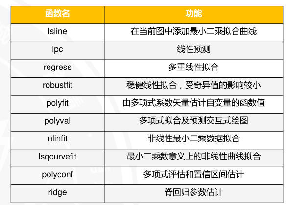

# 基本概念
## 模型
模型是对现实世界的一种抽象，是对现实世界中某些变量的集合以及它们之间的关系的描述。
例如：
- 物理模型：万有引力定律，冷却问题，电磁学，流体力学，热力学，电动力学等。
- 生物模型：细胞分裂，免疫系统，遗传学，免疫治疗等。
- 经济模型：供需关系，市场结构，利润分配，货币政策等。
- 线性模型：描述两个或多个变量之间的线性关系。
- 非线性模型：描述两个或多个变量之间的非线性关系。
- 决策树模型：描述决策树的结构。
- 神经网络模型：描述神经网络的结构。
### 需要注意的问题
数学模型不一定是数学表达式，例如七桥问题就是一个网络结构模型。
## 简单的举例

## 具体的实现过程

- 采用什么模型
- 模型的结构参数是什么
- 模型的输入输出是什么
- 模型的假设是什么
- 模型的误差是什么
- 模型的性能指标是什么
- 模型的拟合优度是什么
- 参数的估计值如何计算
- 模型的拟合过程是什么
- 模型的预测结果是什么
- 模型的评价指标是什么
- 模型的改进方向是什么
## 分类

# 常见的数学建模方法
## 统计分析
## 时间序列分析
### 定义
时间序列分析是研究时间序列数据（时间序列）的一种统计方法。时间序列数据是指随着时间的推移而变化的数据。时间序列分析的目的是对时间序列数据进行分析，从而发现其中的规律，并对未来进行预测。
- 只要数据有先后顺序就可以视为广义上的时间序列
### 时间序列的取值方式
- 取观测时间点处的瞬间值
- 取观测时间点期间的累计值
- 取观测时间点之前或之后的平均值、中位数、众数等
### 时间序列的组成部分
- 长期趋势：指时间序列的整体趋势，是指时间序列的长期变化趋势。
- 季节性：指时间序列中存在周期性变化，如季节性、年度性、月度性等。
- 周期性：指时间序列中存在周期性变化，如每年、每月、每周、每天、每小时、每分钟等。
- 随机性：指时间序列中存在随机性，如白噪声、随机游走、随机漫步等。
### 时间序列模型
- 加法模型：指时间序列数据可以表示为一阶线性回归模型。
- 乘法模型：指时间序列数据可以表示为二阶线性回归模型。
- 混合模型：指时间序列数据可以表示为多个模型的混合模型。
- 指数平滑模型：指时间序列数据可以表示为指数平滑模型。

### 线性时间序列模型
- 自回归滑动平均模型（ARMA）：指时间序列数据可以表示为一阶或二阶自回归模型。
- 趋势预测模型（ARIMA）：指时间序列数据可以表示为一阶或二阶趋势预测模型。
- 季节性模型(SEASON):指时间序列数据可以表示为季节性模型。
### 非线性时间序列模型
- 非线性时间序列模型：指时间序列数据可以表示为非线性模型。
- 自激励门限自回归模型(SETAR):指时间序列数据可以表示为非线性自回归模型。
- 指数自回归(EAR)模型：指时间序列数据可以表示为非线性自回归模型。
### 时间序列的特点
- 时间序列依赖于时间，数据的取值依赖于时间的变化。
- 时间序列具有随机性，数据是不断变化的，不能用过去的数据来预测未来的数据。
- 前后数据之间存在相关性，存在相关性的两个数据之间不能用过去的数据来预测未来的数据。
- 整体上看，时间序列数据呈现出长期趋势、季节性、周期性。
### 时间序列的概念和特征
- 时间序列分析是指研究时间序列数据（时间序列）的一种统计方法。时间序列数据是指随着时间的推移而变化的数据。时间序列分析的目的是对时间序列数据进行分析，从而发现其中的规律，并对未来进行预测。
- 用于解决实际问题。其基本思想是根据系统有限长度的运行记录（历史数据），建立模型，评估数据质量，预测未来数据。
### 时间序列分解
- 趋势分量：时间序列的趋势分量代表序列均值的持续(presistent)、长期变化(long-term change)。 趋势是一系列中移动最慢的部分，代表了最大时间尺度的重要性。 在产品销售的时间序列中，随着越来越多的人逐年意识到该产品，市场扩张的影响可能是增加趋势。
- 循环分量：时间序列的循环分量（Cyclic Component）是指时间序列中存在的周期性波动，它通常表现为比季节性更长的周期。与季节性分量不同，循环分量没有固定的周期长度，并且周期长度通常较长，可能涵盖几年甚至几十年。

时间序列的循环分量代表序列的周期性变化。 循环分量是指时间序列中存在的周期性变化，如季节性、年度性、月度性等。 循环分量的存在使得时间序列具有周期性，并对其进行建模。
- 季节分量：时间序列的季节分量（Seasonal Component）是指时间序列中存在的季节性变化，如每年、每月、每周、每天、每小时、每分钟等。 季节分量是指时间序列中存在的周期性变化，其周期长度通常较短，如每月、每周、每天等。
- 不规则分量：时间序列的不规则分量（Irregular Component）是指时间序列中存在的不规则变化，如跳跃、缺失、异常等。 不规则分量是指时间序列中存在的不规则变化，其变化规律不明显，可能是由于偶然因素引起的。
### 时间序列分析方法
- 1.滑动平均模型（Moving Average Model）：是一种简单而有效的预测方法，它通过对时间序列数据进行滑动平均来预测未来的数据。
- -  类似于股票中的XX天均线
- -  优点：简单、易于理解、计算量小
- -  缺点：对数据噪声敏感、对非平稳数据敏感、对长期趋势不敏感，N太大时，数据的损失也越大
- 2.加权滑动平均模型（Weighted Moving Average Model）：是一种改进的滑动平均模型，它通过对时间序列数据进行加权滑动平均来预测未来的数据。
- - 多了一个加权引子，作用是消除干扰，显示序列的趋势性变化。
- - 优点：可以增加某些重点数据的权重，使得预测更加准确。
- - 缺点：没有确切的理论来决定加权因子如何选取。
- 二次滑动平均模型（Double Moving Average Model）：是一种预测方法，它通过对一次滑动平均之后的数据进行再次滑动平均来预测未来的数据。
- 指数滑动平均模型（Exponential Moving Average Model）：是一种预测方法，它通过对时间序列数据进行指数滑动平均来预测未来的数据。
- - 目的是为了去除季节性效应以及不规则效应，使数据呈现出平滑的趋势。
### 应用方向

### 时间序列的统计量
- 基本统计量如均值、方差、协方差、相关系数、偏度、峰度等。
- 数据中心趋势度量如离差
- 数据的散布度量如标准差方差
### 时间序列的相关特征量

### 时间序列拟合函数

