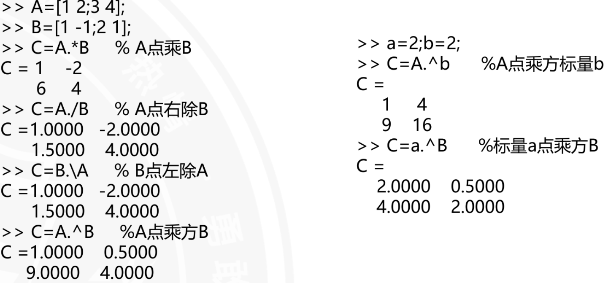

# 矩阵及其运算

## 矩阵的创建

```matlab
% 1. 直接创建矩阵
A = [1 2 3; 4 5 6];


% 2. 利用冒号运算符创建矩阵
B = [1:10];

% 3. 利用linspace函数创建矩阵
C = linspace(1, 10, 10);


% 4. 利用logspace函数创建矩阵
D = logspace(1, 10, 10);

% 5. 利用文本文件创建矩阵
load('data.txt');
E = textread('data.txt');

% 6. 利用M文件创建矩阵
load('data.mat');
F = data;
```
## 特殊矩阵的生成

```matlab
% 1. 单位矩阵
I = eye(n);

% 2. 零矩阵    
Z = zeros(n, m);

% 3. 随机矩阵
X = rand(n, m);

% 4. 正态分布随机矩阵
Y = randn(n, m);

% 4. 斜对角矩阵
L = diag([1, 2, 3]);

% 5. 正交矩阵
Q = orth([1, 2, 3]);

% 6. 伪逆矩阵
P = pinv(A);

% 7. 上三角矩阵
U = triu(A);

% 8. 下三角矩阵
L = tril(A);       
```
## 矩阵的修改

```matlab
% 1. 矩阵的部分替换
A(2, 3) = 9;

% 2. 矩阵的整行替换
A(2, :) = [7 8 9];

% 3. 矩阵的整列替换
A(:, 2) = [4 5];

% 4. 矩阵的切片替换
A(1:3, 1:3) = [1 2 3; 4 5 6; 7 8 9];

% 5. 矩阵的合并
A = [A, B];

% 6. 矩阵的部分扩展
A = [A, 10];
A=[1 0 0 0 ;0 1 0 0 ]
B=eye(2)
C=zeros(2)
M=[A;C B]
```
## 矩阵的删除

```matlab
% 1. 矩阵的部分删除
A(2, 3) = [];

% 2. 矩阵的整行删除
A(2, :) = [];

% 3. 矩阵的整列删除
A(:, 2) = [];

% 4. 矩阵的切片删除
A(1:3, 1:3) = [];

% 5. 矩阵的分割
[A1, A2] = split(A, 2, 2);

```
## 矩阵的其他变换

```matlab
% 1. 平铺矩阵函数
A = [1 2 3; 4 5 6];
M = repmat(A, 2, 3);
将矩阵A按照块状复制2行3列，得到M。

% 2. 指定维数的拼接函数
A = [1 2 3; 4 5 6];
B = [7 8 9; 10 11 12];
C = [A, B];
M1=cat(1, A, B);%按行拼接
M2=cat(2, A, B);%按列拼接
M3=cat(3, A, B);%按块拼接(三维拼接)
```
## 矩阵的结构变换

```matlab
% 1. 矩阵的转置
A = [1 2 3; 4 5 6];
B = A';
将矩阵A转置得到B。

% 2. 矩阵的行列互换
A = [1 2 3; 4 5 6];
B = A';
C = B';
将矩阵A的行列互换得到B和C。

% 3. 矩阵的上下行对调
A = [1 2 3; 4 5 6];
B = flipud(A);
将矩阵A上下对调得到B。

% 4. 矩阵的左右列对调
A = [1 2 3; 4 5 6];
B = fliplr(A);
将矩阵A左右对调得到B。
B=[[3,2,1;6,5,4]]

% 5.逆时针旋转矩阵
A = [1 2 3; 4 5 6];
B = rot90(A);
将矩阵A逆时针旋转90度得到B。

% 6. 顺时针旋转矩阵
A = [1 2 3; 4 5 6];
B = rot90(A, k);
k为旋转的次数，将矩阵A逆时针旋转k*90度得到B。
```
## 矩阵的运算

```matlab
% 1. 矩阵的加法
A = [1 2 3; 4 5 6];
B = [7 8 9; 10 11 12];
C = A + B;


% 2. 矩阵的减法
A = [1 2 3; 4 5 6];
B = [7 8 9; 10 11 12];
C = A - B;


% 3. 矩阵的乘法
A = [1 2 3; 4 5 6];
B = [7 8 9; 10 11 12];
C = A * B;


% 4. 矩阵的除法
A = [1 2 3; 4 5 6];
B = [7 8 9; 10 11 12];
C = A / B;


% 5. 矩阵的乘方
A = [1 2 3; 4 5 6];
B=A^n;
表示矩阵A的各元素的n次方。
n>0时表示A自乘n次
n<0时表示A的逆矩阵自乘n次

% 6. 矩阵的点运算
A = [1 2 3; 4 5 6];
B = [7 8 9; 10 11 12];
C = A.* B;
表示矩阵A和B的对应元素相乘。
C = A.\ B;
C = A./B;
这两个的区别类似于除和除以
C = A.^B;
表示矩阵A和B的对应元素乘方运算。

% 7. 矩阵点运算求函数值
x=0:0.1:2*pi;
y=exp(x).*sin(x);
不能用*。因为这俩都是都是同维度的矩阵

```

## 矩阵的分析
### 方矩阵的行列式
```matlab
A = [1 2 3; 4 5 6; 7 8 9];
det(A)    
```
>运算结果：-30
### 矩阵的秩
```matlab
A = [1 2 3; 4 5 6; 7 8 9];
rank(A)    
% 线性无关的行有多少个，秩就是这个数
```
>运算结果：2
### 矩阵的迹
```matlab
A = [1 2 3; 4 5 6; 7 8 9];
trace(A)    
% 矩阵的主对角线元素之和
```    
运算结果：15
### 矩阵的逆
```matlab
A = [1 2 3; 4 5 6; 7 8 9];
inv(A)    
%矩阵和逆矩阵的乘积为单位矩阵
```
运算结果：
```matlab
ans =

    -0.1538   0.1538  -0.0769
    -0.0769   0.0769   0.1538
     0.3077  -0.3077   0.3846
```
### 矩阵的特征值和特征向量
```matlab
A = [1 2 3; 4 5 6; 7 8 9];
[val, vec] = eig(A);
% 特征值val和特征向量vec
```
运算结果：
```matlab
val =

    -1.5385   0.0000   6.1538
vec =

    -0.2692   0.7692  -0.5385
    -0.5385   0.2692   0.7692
     0.7692  -0.5385   0.2692
```
#### 运用特征值求解一元多次方程的根
```matlab
a=[1 -5 5 5 -6 0]%各项系数
A=compan(a)%求伴随矩阵
X1=eig(A)%求特征值和特征向量
```
运算结果：
```matlab
X1 =

         0
    3.0000
    2.0000
    1.0000
   -1.0000
```
### 矩阵的分解
#### 1.高斯消去法分解矩阵
```matlab
A = [1 2 3; 4 5 6; 7 8 9];
[L, U] = lu(A);
% L为下三角矩阵，U为上三角矩阵，P为单位矩阵的行变换矩阵

```
运算结果：
```matlab
L =
   1.0000   0.0000   0.0000
   4.0000   1.0000   0.0000
   7.0000   2.0000   1.0000
U =
   1.0000   2.0000   3.0000
   0.0000   1.0000   2.0000
   0.0000   0.0000   1.0000
```
#### 2.QR正交分解矩阵（找到独立特征根）
```matlab
A = [1 2 3; 4 5 6; 7 8 9];
[Q, R] = qr(A);
% Q为正交矩阵，R为上三角矩阵
```
运算结果：
```matlab
Q =
   0.8944   0.3314  -0.2774
   0.4472  -0.8944   0.0000
   0.1464   0.2774   0.9511
R =
   9.5393   0.0000   0.0000
   0.0000   7.1716   0.0000
   0.0000   0.0000   3.8284
```
#### 3.SVD分解矩阵（找到奇异值）
```matlab
A = [1 2 3; 4 5 6; 7 8 9];
[U, S, V] = svd(A);
% U为正交矩阵，S为奇异值，V为正交矩阵
```
运算结果：
```matlab
U =
   0.8944   0.4472   0.1464
   0.3314  -0.8944   0.2774
  -0.2774   0.0000   0.9511
S =
   10.4853
  -0.0000
   0.0000
V =
   0.5762  -0.5762   0.5762
   0.5762   0.5762  -0.5762
   0.5762  -0.5762   0.5762
```    
### 矩阵的信息获取函数
```matlab
A = [1 2 3; 4 5 6; 7 8 9];
size(A)    
% 矩阵的维数
length(A)    
% 矩阵的行数
numel(A)    
% 矩阵的元素个数
rank(A)    
% 矩阵的秩
trace(A)    
% 矩阵的迹
det(A)    
% 矩阵的行列式
norm(A)    
% 矩阵的范数
cond(A)    
% 矩阵的条件数
```
### 两个应用实例
#### 矩阵在图像处理中的应用
```matlab
A=imread('D:\微信聊天记录\WeChat Files\All Users\dcbcc366d1d778e5017b72fc286666ec.jpg'); 
subplot(2,3,1)
imshow(A)
title('原始图像') 
B=fliplr(A); 
subplot(2,3,2) 
imshow(B); 
title('左右对调') 
C=flipud(A); 
subplot(2,3,3)
imshow(C) 
title('上下对调') 
D=rot90(A); 
subplot(2,3,4)
imshow(D)
title('逆时针旋转90度')
E=rot90(A,-1)
subplot(2,3,5)
imshow(E)
title('顺时针旋转90度')
F=repmat(A,3,2); 
subplot(2,3,6) 
imshow(F)
title('图像平铺2*3块')
```
结果：

# I/O操作
## 文本文件操作
```matlab
fopen('data.txt', 'w');%打开文件，写入模式
fopen('data.txt', 'r');%打开文件，读取模式
fopen('data.txt', 'a');%打开文件，追加模式
freadd('data.txt');%读取文件内容
fwrite('data.txt', 'Hello, world!\n');%写入文件内容
fclose('data.txt');%关闭文件
feof('data.txt');%判断文件是否结束
ferror('data.txt');%判断文件是否出错
frewind('data.txt');%将文件指针指向文件头(将文件位置指示到文件开始)
fseek('data.txt', 10, 1);%将文件指针指向第10个字节处(1为相对位置，0为绝对位置)
ftell('data.txt');%获得文件位置指示器
fgets('data.txt');%读取一行内容,不保留结束符
fgetl('data.txt');%读取一行内容，保留结束符
input('请输入内容：');%读取键盘输入
textread('data.txt');%读取文本文件内容,从文件中读取格式化的数据
fprintf('data.txt', '%d %d %d\n', 1, 2, 3);%写入格式化数据到文件
fscanf('data.txt', '%d %d %d', a, b, c);%读取格式化数据
```
## 文件的关闭
```matlab
sta=fclose(fid);
% 关闭文件，返回状态值sta，0表示成功，其他表示失败
```
## 二进制文件的读写操作
```matlab
[A,COUNT]=fread(fid, size, precision);
读取二进制文件内容，返回矩阵A和读取字节数COUNT。
fid为文件句柄。
size为读取的字节数,N表示读取N个元素到一个列向量，lnf表示读取整个文件，[M,N]表示读取到M行N列的矩阵。
precision为读写数据的类型,如'uint8'表示读取8位无符号整数,默认是'float32'表示读取32位浮点数。
```
## 写二进制文件
```matlab
COUNT=fwrite(fid, A, precision);
% 向文件写入矩阵A，返回写入字节数COUNT。
fid为文件句柄。
A为待写入矩阵。
precision为读写数据的类型,如'uint8'表示写入8位无符号整数,默认是'float32'表示写入32位浮点数。
```
## 文本文件的读写操作
```matlab
% 读写文本文件
[A,COUNT]=fscanf(fid, format,size);%读取格式化数据
fid为文件句柄
format为读取数据的格式
size为可选项，决定矩阵A中数据的排列形式
```
## 文本文件的读写操作
```matlab
% 读写文本文件
COUNT=fprintf(fid, format, A);%写入格式化数据
fid为文件句柄
format为写入数据的格式
A为待写入数据
先按照format格式写入数据，然后写入到fid文件句柄中。格式符与fscanf函数相同。
```
## 数据文件定位
```matlab
% 数据文件定位
status=fseek(fid, offset, origin);
% 定位文件指针，返回状态值status，0表示成功，其他表示失败。
fid为文件句柄。
offset为偏移量，表示从origin位置开始的偏移量。
origin为起始位置，0表示文件头，1表示当前位置，2表示文件尾。
```
```matlab
position=ftell(fid);
% 获得文件位置指示器，返回当前位置。
fid为文件句柄。
```
