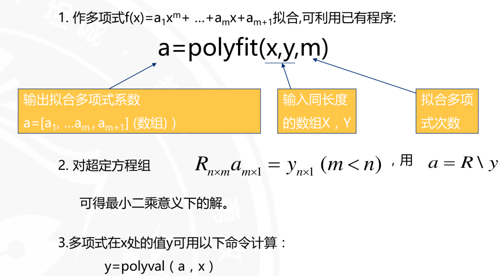

# 拟合与插值法的关系

拟合与插值法的关系是：拟合是从已知数据中找到一条曲线或曲面，而插值是根据已知数据点，在某一点附近生成新的点。

拟合的目的是找到一条曲线或曲面，使得曲线或曲面与已知数据点的距离最小。而插值的目的是生成新的点，使得这些点与已知数据点的距离最小。
# 曲线拟合最常见的解法

曲线拟合最常见的解法是最小二乘法。

最小二乘法是一种数学优化方法，它通过最小化误差的平方和来拟合曲线。

最小二乘法的基本思想是：找到一条直线或曲线，使得它与已知数据点的距离最小。

具体地，最小二乘法的求解方法是：

1. 确定待拟合的函数形式。
2. 确定待拟合的数据点。
3. 利用公式或方程，求解拟合参数。
4. 利用拟合参数，计算拟合曲线或曲面的各点坐标。
5. 计算拟合曲线或曲面的误差。
6. 利用误差，判断拟合是否合理。

# 用matlab拟合曲线
