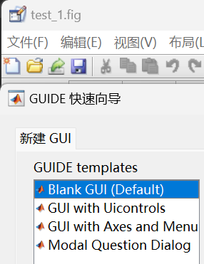

# 调试技巧
## 技巧一：函数
### 子函数
子函数可以帮助我们将复杂的程序分解为更小的函数，使得代码更容易理解和维护。
### 局部函数
局部函数可以帮助我们隐藏函数的实现细节，使得代码更易于阅读和理解。
### 局部函数与子函数的区别
局部函数和子函数的区别在于：
- 局部函数只能在函数内部使用，而子函数可以在函数外部使用。
- 局部函数可以访问函数的局部变量，而子函数只能访问函数的全局变量。
- 局部函数可以访问函数的作用域，而子函数只能访问父函数的作用域。
- 局部函数可以访问函数的返回值，而子函数只能访问父函数的返回值。
- 子函数可以访问父函数的私有变量，而局部函数不能访问父函数的私有变量。
- 子函数可以重载父函数，而局部函数不能重载父函数。
- 子函数可以访问父函数的属性，而局部函数不能访问父函数的属性。
- 子函数可以访问父函数的静态变量，而局部函数不能访问父函数的静态变量。
- 子函数可以访问父函数的成员函数，而局部函数不能访问父函数的成员函数。
- 子函数可以访问父函数的私有成员函数，而局部函数不能访问父函数的私有成员函数。
- 子函数可以访问父函数的静态成员函数，而局部函数不能访问父函数的静态成员函数。
- 子函数可以访问父函数的父类，而局部函数不能访问父函数的父类。
- 子函数可以访问父函数的父类的成员函数，而局部函数不能访问父函数的父类的成员函数。
- 子函数可以访问父函数的父类的私有成员函数，而局部函数不能访问父函数的父类的私有成员函数。
- 子函数可以访问父函数的父类的静态成员函数，而局部函数不能访问父函数的父类的静态成员函数。
### 调用函数时的检测顺序
调用函数时，MATLAB会按照以下顺序检测函数是否存在：
1. 当前函数作用域
2. 父函数作用域
3. 全局作用域
4. 系统函数库
5. 其他路径下的函数库等
总而言之，首先检测该函数是否为此文件的子函数；
如果不是，再检测是否为可用的局部函数；
如果不是，再检测是否为系统函数；
**宁可用局部函数，也不要用子函数，因为子函数只能在函数内部使用，而局部函数可以在函数外部使用。**

## 技巧二：debug操作
调试器的用法：
运行并计时
打断点
## 技巧三：P码文件操作（自保护）
可以用.p文件来保存文件，能保护代码和知识产权。

# 常见错误排除
用GPT就行了
# MATLAB图形用户界面
MATLAB的图形用户界面（GUI）是基于图形的交互式环境，它提供了丰富的图形工具，可以帮助用户创建、编辑、运行程序。
## 三大特点
1.简单性：MATLAB的图形用户界面简洁、直观，用户只需通过鼠标点击、拖动、双击等操作就可以完成各种操作。
2.习惯性：MATLAB的图形用户界面遵循用户习惯，用户熟悉的操作方式，可以提高工作效率。
3.一致性：MATLAB的图形用户界面具有一致性，所有的图形组件都具有相同的外观和感觉，使得用户的操作习惯更加一致。
## GUI设计步骤
1.需求分析：确定用户需要完成的任务，明确目标。
2.界面布局设计：设计图形界面，确定各个组件的位置、大小、功能。
3.属性设置：设置组件的属性，如字体、颜色、透明度、边框等。
4.交互设计：设计交互方式，如按钮、菜单、对话框等。
## GUI设计窗口的保存

# GUI设计类似于winform的设计，跳过了先

