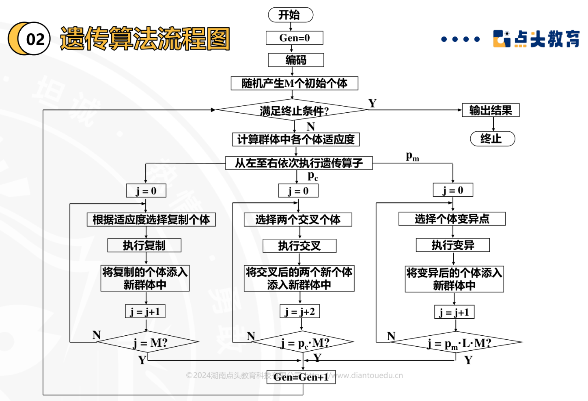
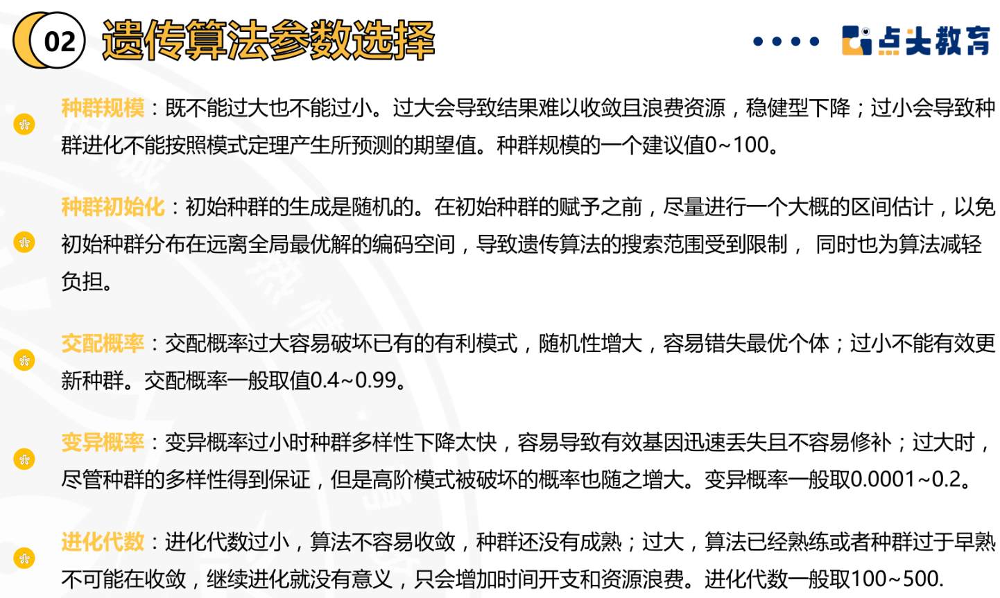
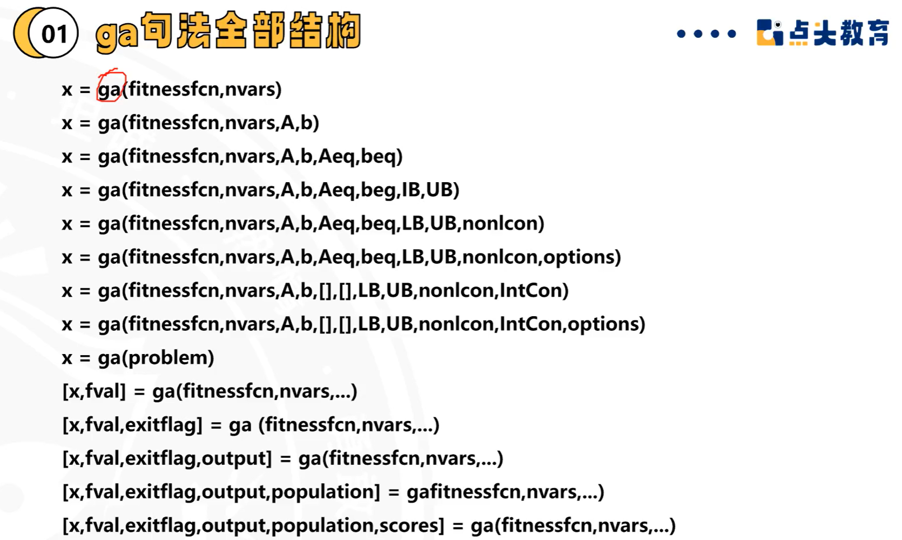
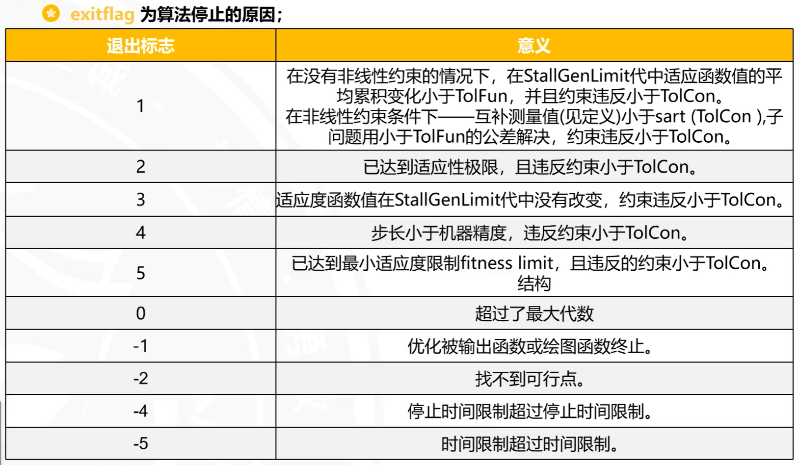
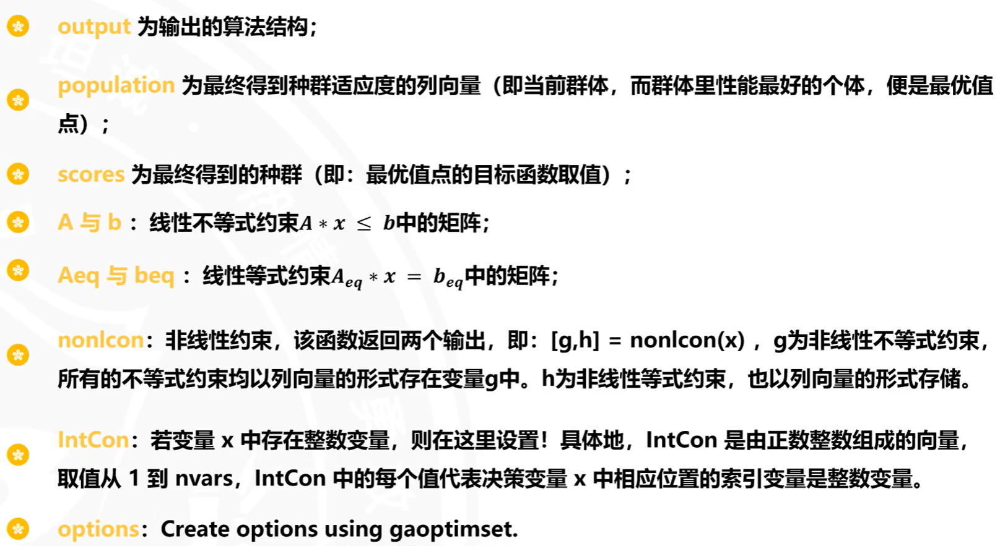
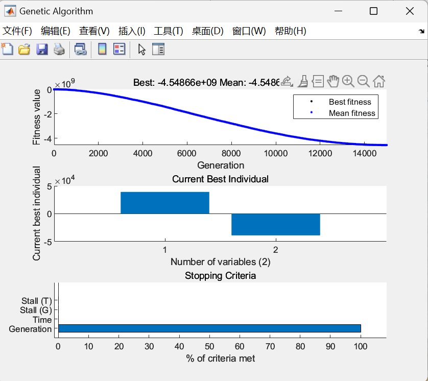
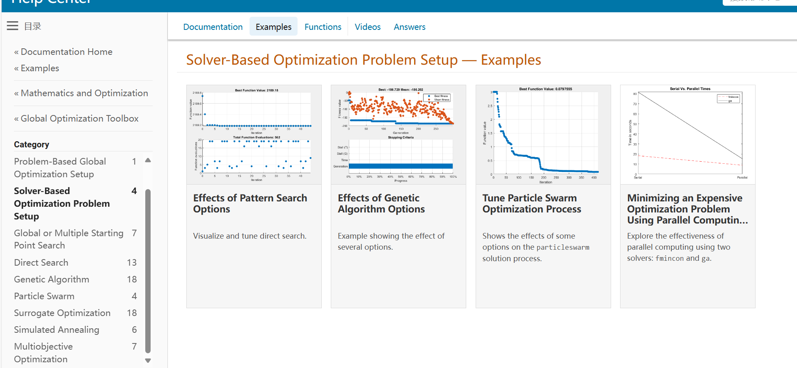
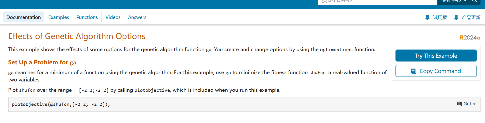
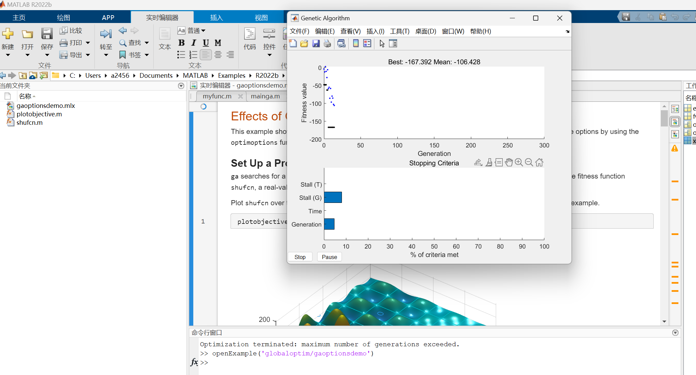

# 遗传算法的流程图

# 参数的选择

# 遗传算法擅长解决的问题是全局最优问题

# 运行结果含义


# 实战
# 函数代码
```matlab
function f = myfunc(x)
    f =(339-0.01*x(1)-0003*x(2))*x(1)+(339-0.004*x(1)-0.01*x(2))*x(2)-(400000+195*x(1)+225*x(2));
%% GA最小值
    f = -f;
end
```
# 遗传算法代码
```matlab
clc
clear
options = gaoptimset('PopulationSize', 20, ...%种群中个体的数目
                        'EliteCount' , 10,...%精英个体数目
                        'CrossoverFraction',0.75,...%交叉概率
                        'Generations',15000, ...%迭代代数
                        'StallGenLimit',500, ...%停止代数
                        'TolFun',1e-100,...%适应度偏差
                        'PlotFcns',{@gaplotbestf, @gaplotbestindiv, @gaplotstopping}...
                        );
options.Generation = 2000;
[x,fval,exitflag,output] = ga(@myfunc,2,[],[],[],[],[],[],[],options);
```
# 运行结果图

# matlab代码平台
## mathwork:
### <https://ww2.mathworks.cn/help/index.html?s_tid=CRUX_lftnav>

点击左侧的example，再点击上部的example，可以看到一些实战代码，这些代码可以在MATLAB中运行

点击copycommand，可以复制代码到剪贴板，然后在MATLAB中粘贴运行。


