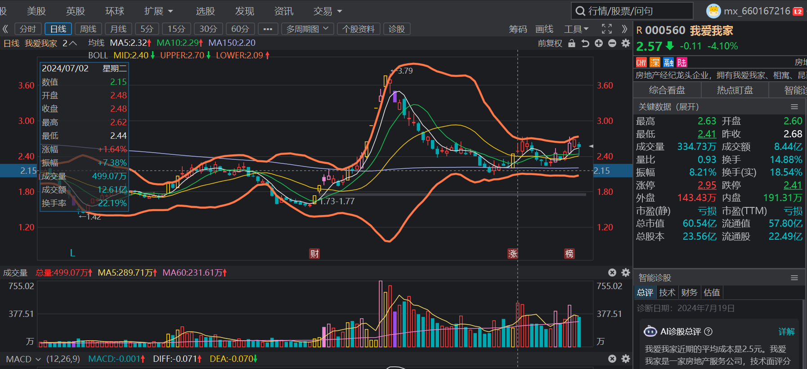
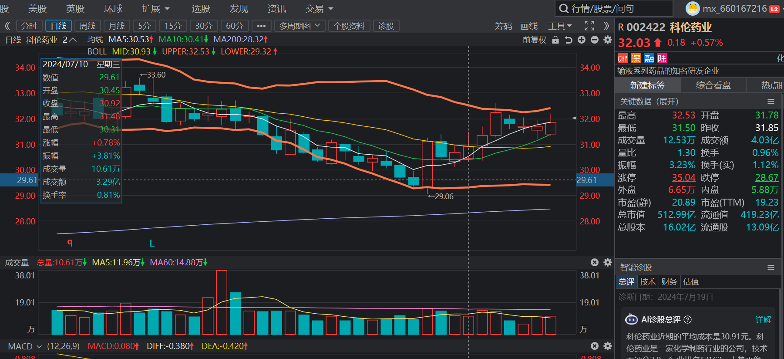
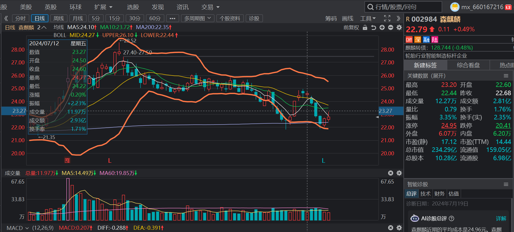

# 常见的技术指标
## 布林带bool
布林带是指股价在波动过程中围绕着两个极值上下跳动的过程，布林带的形状和强度反映了市场的多空力量对比。布林带由下影线和上影线组成，下影线表示股价下跌，上影线表示股价上涨。布林带的宽度和位置决定了股价的波动范围。
依据的是高斯分布，股价突破上轨或者砸穿下轨的概率只有区区2.3%
所以可以将布林带作为卖出信号之一
### 应用：
如果选股当天股价收盘价达到了布林线上轨，则不进场，等待几个交易日，直到不断缩量的情况下成交量开始放大。
##

# 5日线金叉10日线战法
# 进场价格确定方法：
5日线附近，bool值距离上轨较远
# 弊端
> 趋势线是有道理的，趋势一直下行的不要
> 震荡会很难操作，震荡的判断方法有
>  > 
>  > 上升趋势转变成震荡的那种形态是可以判断出来的
>  > 下降通道转变为震荡也可以判断出来的
>  > 上面两种情况一定不要尝试去操作。因为对错可能一半一半，不正常的行情波动还会导致心态的变化
成功情况：
失败情况：
>  > bool值的中线（20日线）站稳再操作安全性更好
举例：7.2日

# 做一个尾盘买入隔日套利不知道这个方案怎么样
## 找找案例(7.1日)
成功：当日缩量上涨
成功：当日缩量上涨
成功：当日缩量上涨
成功：当日缩量上涨
第二日才成功：当日放量上涨
第二日才成功：当日放量上涨
## 7.2日
失败：轻微的放量!
原因可能是十日线对应的趋势不够明显，是下行的
成功但是获利很少：轻微放量
成功：

## 7.3日
失败：十日线没有走平或者向上，而且这些均线都是粘合的，明显的震荡行情。
成功：十日线只是向下走了0.1%以内
成功：十日线只是向下走了0.5%以内
成功：

## 7.4日
失败：
成功：
这两个是高位下来的一个金叉，已经可以看出趋势不合理了，就看怎么处理了。个人感觉风险比机会更大。高位的时候要注意风险。20日线接近死叉200日线的时候风险极大。
成功：
## 7.5日
成功：但是持股周期是7天

## 7.10日
成功：
## 7.11日

失败：
失败原因是近期创过新高，有回调的需要。一定不要尝试逆势操作
失败：
同样的原因。逆势操作很危险。
失败：
**不知道什么原因**
成功：
## 1.26
失败：
原因：虽然所有的指标都正常，但是上方有一段很大的套牢盘压力位。实际上上冲的获利难度相当大。
失败：
原因：筹码结构难看，不要去赌一个不确定的机会。这是交易系统
## 

#
# 正向操作信号
## .一定要站稳中轨一段时间，或者连续几天尝试突破（很重要的一点）
## .上涨同时十日线向上，这个标准不太合理感觉。不能用-0.05判断趋势，应该用百分比
## .距离上轨有一定的空间
## .红盘

# 负面信号帮助排除
## .20日均线和200日均线即将死叉。或者说，就是20日线趋势是向下的。近期创过新高，有回调的需要。一定不要尝试逆势操作。判断标准是20日均线和200日均线即将死叉。这种情况一定会回到200日均线试探一下支撑。回踩确认才是一个比较安全的操作信号。
## .均线反复粘合的判断为震荡行情，不要操作
## 20日线向上或者走平这样操作更有性价比
## 上方的筹码压力不能太大

## 缩量上涨的走法好像更容易成功？？？好像不是这样的啊

## 我发现，能成功是因为股价没有到bool的上限值，所以一波行情没有走完，因此尾盘买入或者第二天再买实际上效果是一样的。吃的都是冲到bool顶点的这一波利润？？？

# 等待时机，大概是五天之内回到10日线支撑，这个点进场成功率很可观。案例太多了感觉，回调之后的才是机会？？？
# 成功率的高低可以决定仓位的大小。规避风险
# 这种在200日线附近的金叉好像收益很可观啊
成功：

失败：
做多时机不对，应该是收盘价站上20日均线的次日。

