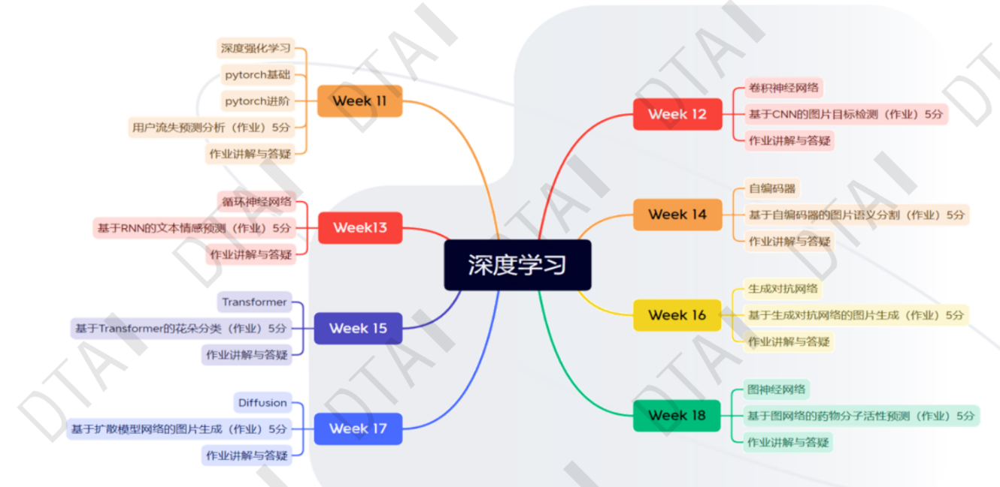
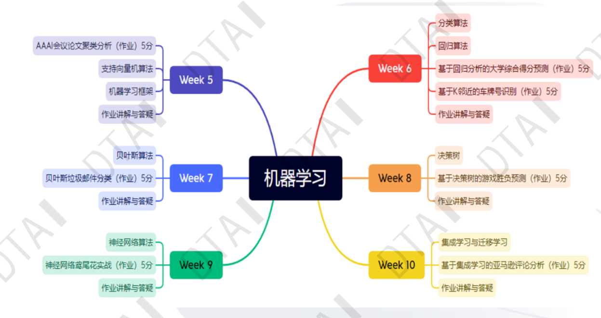

# 机器学习核心概念
1.数据驱动(深度学习)
2.自动化学习
3.泛化能力
4.反馈循环
# 机器学习的分类
1.有监督学习(数据存在真值)
2.无监督学习(聚类，降维)【基于数据的相似性】
3.强化学习(模型数据与环境进行互动)
# 机器学习的其他衍生分类
1.半监督学习
2.集成学习
3.迁移学习
# 机器学习与深度学习
### 1.定义
深度学习是基于神经网络的一些变体算法和模型，属于机器学习的一类
### 2.优势
深度学习的效果在一些复杂任务上性能更加好
### 3.特点
模型复杂性
计算需求大
数据驱动型（数据量大）
可解释性较差
# 机器学习之数据准备
### 数据预处理
数据清洗
特征缩放【归一化】(数据的值域划分，缩放到相同维度，避免模型失真)
特征工程(提取关键特征)
数据编码
数据划分(训练集，测试集，验证集)
# 机器学习之模型选择
性能(首要因素)
复杂性(过拟合现象)
解释性
训练时间

# 机器学习之损失函数
衡量预测值与真值之间的差异
平方差
$MSE=\frac{1}{n}\sum_{i=1}^{n}(y_{i}-\hat{y}_{i})^{2}$
交叉熵公式
# 机器学习之优化算法(有监督学习)
梯度下降法
按照梯度函数的反方向找到梯度的极值点
为了找到损失函数的最小值，我们对损失函数求梯度，沿着梯度的反方向逼近损失函数，从而找到损失函数的最小值
# 机器学习之评估指标
混淆矩阵
真正例
假正例
真负例
假负例
$$Accuracy=\frac{TP+TN}{TP+TN+FP+FN}$$
$$Precision=\frac{TP}{TP+FP}$$
$$ AUC曲线$$
$$ F1-Scoreh函数$$

